# Local SillyTavern with Memory Management

This is a self-hosted roleplay/chat setup that runs entirely on your own hardware — local model, local memory, local everything. Nothing goes to a cloud API. You chat through SillyTavern, from this machine or from another device over Tailscale, and the system remembers things about you and your characters across conversations.

## The pieces

- **llama.cpp** runs the actual language model on your GPU. One model handles both the roleplay replies and the memory extraction. (This replaced Ollama for a measured performance gain; see [docs/LLAMA_CPP_BENCHMARK.md](docs/LLAMA_CPP_BENCHMARK.md) for the comparison.)
- **Qdrant** is the vector database that memories actually live in.
- **mem0** is the memory engine sitting on top of Qdrant — it decides what's worth remembering from a conversation, stores it, and pulls relevant memories back out when they're needed.
- **SillyTavern** is the chat frontend you actually talk to. It's wired up to llama.cpp for generation and to mem0 through a custom plugin + extension pair that injects relevant memories into the prompt and sends new facts back after each exchange.

Everything runs in Docker on one machine. Only SillyTavern is exposed beyond localhost — reachable locally, or from another device over Tailscale — with basic auth and an IP whitelist on top for access control.

<p align="center">
  
</p>

## What it can actually do right now

- Chat with a local (and uncensored) model in SillyTavern, letting it role-play as different characters.
- Store memories about you locally:
  - Shared memory layer: facts about you (favorite foods, your job, whatever comes up)
  - Character-specific memory layer: things specific to one character's relationship/history with you
  - Automatically sort which is which and separately store the two layers
  - Browse, hand-edit, delete, or bulk find-and-replace memories through a small web UI, without touching the database directly
- Reach the whole thing from another device (phone, laptop) over Tailscale without exposing anything to the open internet

## Setting it up

### Before you start

You'll need a Linux computer with an NVIDIA GPU, [Tailscale](https://tailscale.com) set up on it (and on whatever device you want to reach it from), and native Docker Engine — not Docker Desktop. The following commands walk through the set-up on a Ubuntu 22.04 computer. Ask a LLM to adjust them for your own hardware.

Windows isn't directly supported, but should work through WSL2 — install Docker Engine (not Docker Desktop) inside a WSL2 Ubuntu distro, keep the repo on the WSL2 filesystem rather than `/mnt/c/...`, and set up GPU passthrough via [NVIDIA's CUDA on WSL support](https://docs.nvidia.com/cuda/wsl-user-guide/index.html) before installing the NVIDIA Container Toolkit below. Untested by this project — expect to adapt some steps.

---

If you don't have native Docker Engine yet,

```bash
sudo apt-get update
sudo apt-get install -y ca-certificates curl
sudo install -m 0755 -d /etc/apt/keyrings
sudo curl -fsSL https://download.docker.com/linux/ubuntu/gpg -o /etc/apt/keyrings/docker.asc
sudo chmod a+r /etc/apt/keyrings/docker.asc
echo "deb [arch=$(dpkg --print-architecture) signed-by=/etc/apt/keyrings/docker.asc] https://download.docker.com/linux/ubuntu $(. /etc/os-release && echo "$VERSION_CODENAME") stable" | sudo tee /etc/apt/sources.list.d/docker.list > /dev/null
sudo apt-get update
sudo apt-get install -y docker-ce docker-ce-cli containerd.io docker-buildx-plugin docker-compose-plugin
sudo usermod -aG docker $USER
newgrp docker
```

And the NVIDIA Container Toolkit, so containers can actually see the GPU:

```bash
curl -fsSL https://nvidia.github.io/libnvidia-container/gpgkey | sudo gpg --dearmor -o /usr/share/keyrings/nvidia-container-toolkit-keyring.gpg
curl -s -L https://nvidia.github.io/libnvidia-container/stable/deb/nvidia-container-toolkit.list | sed 's#deb https://#deb [signed-by=/usr/share/keyrings/nvidia-container-toolkit-keyring.gpg] https://#g' | sudo tee /etc/apt/sources.list.d/nvidia-container-toolkit.list
sudo apt-get update
sudo apt-get install -y nvidia-container-toolkit
sudo nvidia-ctk runtime configure --runtime=docker
sudo systemctl restart docker
```

Quick sanity check that GPU passthrough actually works: `docker run --rm --gpus all nvidia/cuda:12.6.0-base-ubuntu22.04 nvidia-smi` should print your GPU info from inside the container.

### Getting the app running

**1. Clone the repo:**

```bash
git clone https://github.com/chuyaowang/local-sillytavern-with-memory.git
cd local-sillytavern-with-memory
```

**2. Bring your own model.** The model files aren't in this repo (they're multi-gigabytes). Drop one in `models/`, then point `llama-cpp/models-preset.ini`'s `model =` line at its filename. The default model, which has been tested to work, is [a quantized and abliterated Gemma 4 E4B model](https://huggingface.co/HauhauCS/Gemma-4-E4B-Uncensored-HauhauCS-Aggressive/blob/main/Gemma-4-E4B-Uncensored-HauhauCS-Aggressive-Q4_K_P.gguf), which fits in the 6GB VRAM of a NVIDIA GTX 1660Ti card. The preset's `ctx-size` needs to stay at 16384 or higher — the memory extraction prompt alone is around 8,000 tokens, and a smaller context window will silently truncate it and break extraction.

See [Changing the model](#changing-the-model) below if you want to switch to a different one later.

**3. Set up SillyTavern's config.** Copy the template and fill in your own values:

```bash
cp sillytavern/config/config.yaml.example sillytavern/config/config.yaml
```

Then edit that file and set a real `basicAuthUser.username`/`password`, and add the actual Tailscale IPs of whatever devices should be able to reach it to the `whitelist` array (`tailscale status` will show you those IPs).

**4. Get the embedding model.** mem0 uses this to turn memories into vectors for Qdrant. Download it straight into `models/`:

```bash
curl -L -o models/nomic-embed-text-v1.5.f16.gguf \
  https://huggingface.co/nomic-ai/nomic-embed-text-v1.5-GGUF/resolve/main/nomic-embed-text-v1.5.f16.gguf
```

**5. Bring up everything:**

```bash
docker compose up -d
```

**6. Point SillyTavern at llama.cpp.** In the SillyTavern UI, go to API Connections, set API type to Text Completion and source to llama.cpp, Server URL to `http://llama-cpp:8080`, then pick your model from the dropdown.

**7. Turn on the memory extension.** In SillyTavern, go to Manage Extensions tab on the top band and enable "Roleplay Memory" — that's what actually wires the chat up to mem0.

### Where things are once it's running

SillyTavern lives at `http://localhost:8000` on the local machine and can be accessed remotely at `http://<tailscale-ip-of-host>:8000` via a tailscale connection from whatever devices you whitelisted. The memory manager UI is local only at `http://localhost:8001/ui/`.

The raw mem0 API docs are at `http://localhost:8001/docs`, and the Qdrant dashboard is at `http://localhost:6333/dashboard`. These two are for debugging only, you will unlikely need to access them.

There's also an optional `docker-compose.prod.yml` overlay for running a second, fully isolated instance to separate development and actual use data — see [Setting up a dev vs. prod environment](#setting-up-a-dev-vs-prod-environment) below if you want to set one up.

## Changing the model

1. **Download a GGUF.** Grab one from Hugging Face or wherever you like. Place it in `models/`. Note that the actual VRAM used is **less than** the size of the GGUF file — not everything in the model needs to be loaded to the GPU (e.g. the token embedding table typically stays on CPU).
2. **Add it to `llama-cpp/models-preset.ini`.** Copy an existing `[section]`, give it a new name, and point `model =` at your filename. Keep `ctx-size` at 16384 or higher — mem0's extraction prompt alone is around 8,000 tokens, and a smaller context window silently truncates it and breaks extraction. If VRAM is tight for this quant, see the `gemma-q8` section's comments for the `--fit`/`n-gpu-layers` tradeoff.
3. **Restart llama.cpp** so it picks up the new preset:

   ```bash
   docker compose restart llama-cpp
   ```

4. **Test it before committing to it:**

   ```bash
   ./scripts/test-model-llama-cpp.sh <new-section-name>
   ```

   This checks text generation, VRAM footprint, and whether the model breaks mem0's memory extraction against a throwaway container, not your real data. Pick a different model if anything fails.
5. **Point SillyTavern at it.** API Connections, re-pick the new model from the dropdown (same place as setup step 6 above). mem0 follows automatically — it reads whichever model SillyTavern is actually using on every request, so there's no separate mem0 config to update.

### Models checked so far

Results from running `scripts/test-model-llama-cpp.sh` against each model, for reference:

| Model | Text generation | VRAM footprint (actual) | Extraction JSON syntax | Extraction pipeline |
| --- | --- | --- | --- | --- |
| [Gemma-4-E4B-Uncensored-HauhauCS-Aggressive-Q4_K_P](https://huggingface.co/HauhauCS/Gemma-4-E4B-Uncensored-HauhauCS-Aggressive/blob/main/Gemma-4-E4B-Uncensored-HauhauCS-Aggressive-Q4_K_P.gguf) | Pass | ~3.3 GB | Pass | Pass |
| [Gemma-4-E4B-Uncensored-HauhauCS-Aggressive-Q8_K_P](https://huggingface.co/HauhauCS/Gemma-4-E4B-Uncensored-HauhauCS-Aggressive/blob/main/Gemma-4-E4B-Uncensored-HauhauCS-Aggressive-Q8_K_P.gguf) | Pass | ~4.7-5.7 GB | Pass | Pass |

Q8 fits, but with a real speed tradeoff when the embedder also needs VRAM — see [docs/LLAMA_CPP_BENCHMARK.md](docs/LLAMA_CPP_BENCHMARK.md) for the full story. Q4 is the safer everyday default.

## Setting up a dev vs. prod environment

By default you have one stack — `qdrant`, `mem0`, `sillytavern` — which is fine if you're not planning to test changes against the memories and chats you actually use day to day. `docker-compose.prod.yml` adds a second, fully isolated stack (`qdrant-prod`, `mem0-prod`, `sillytavern-prod`) so you can develop or try things out without touching your real data. The two stacks share only llama.cpp (GPU/VRAM is the scarce resource, no reason to load the model twice) and the SillyTavern plugin/extension source code; everything else — config, memory data, chat history — is completely separate.

### Creating the prod stack

1. **Create the prod SillyTavern config:**

   ```bash
   cp sillytavern-prod/config/config.yaml.example sillytavern-prod/config/config.yaml
   ```

   Edit it the same way as the dev config above — its own `basicAuthUser.username`/`password` and Tailscale whitelist.
2. **Bring up the prod stack:**

   ```bash
   make prod-up
   ```

   Docker creates `sillytavern-prod/data/` automatically on first run, and SillyTavern populates it with its own fresh defaults — nothing from dev (chats, characters) carries over.

### Switching between them

The Makefile wraps the underlying `docker compose -f docker-compose.yml -f docker-compose.prod.yml ...` commands so you don't have to remember them:

| Command | What it does |
| --- | --- |
| `make dev-up` | Start the dev stack (`qdrant`, `mem0`, `sillytavern`), plus llama.cpp if it isn't already running |
| `make dev-down` | Stop the dev stack, leave llama.cpp and prod running |
| `make prod-up` | Start the prod stack, plus llama.cpp if it isn't already running |
| `make prod-down` | Stop the prod stack, leave llama.cpp and dev running |
| `make down` | Stop everything that's running |
| `make status` | Show what's currently running |

`make dev-up` and `make prod-up` each print that stack's SillyTavern and memory-manager URLs once it's up — dev on `:8000`/`:8001`, prod on `:8010`/`:8011`. Run bare `make` to see this list at any time.

## Third-party components

This repo's own code is Apache-2.0 (see [LICENSE](LICENSE)), but it wires together several separately-licensed pieces you should know about if you're redistributing or building on this:

| Component | License |
| --- | --- |
| [SillyTavern](https://github.com/SillyTavern/SillyTavern) | AGPL-3.0 |
| [llama.cpp](https://github.com/ggml-org/llama.cpp) | MIT |
| [Qdrant](https://github.com/qdrant/qdrant) | Apache-2.0 |
| [mem0](https://github.com/mem0ai/mem0) | Apache-2.0 |
| [nomic-embed-text](https://huggingface.co/nomic-ai/nomic-embed-text-v1.5) | Apache-2.0 |
| Gemma models (base and fine-tunes) | [Gemma Terms of Use](https://ai.google.dev/gemma/terms) — a custom license with a prohibited-use policy, not a standard OSI license |

None of these are vendored into this repo — SillyTavern, llama.cpp, and Qdrant run as their own upstream Docker images, and the model GGUF is something you bring yourself (see step 2 above). SillyTavern's AGPL-3.0 doesn't extend to the server plugin or client extension in this repo, since they're separate code loaded through SillyTavern's public plugin/extension API, not a modified copy of SillyTavern itself.
