# AutoMemory for SillyTavern

AutoMemory is a self-hosted memory system for SillyTavern. From your conversations, it automatically decides what is worth remembering and what facts to bring back without a need for manual curation of memories or setting injection rules.

## Features

- **Three memory scopes** - a **character** memory is private to one relationship between a persona and a character, a **shared** memory follows a person across every character they talk to, and **world lore** belongs to a fictional world itself, retrieved whenever a conversation happens in that world.
- **Automatic extraction and injection** - memories get pulled out of a conversation and woven back into later replies on their own. Retrieval happens via vector similarity search, improving accuracy and relevance over keyword-based approaches.
- **Convenience Tools** - a specialized character to build new lorebooks from conversations into the AutoMemory system and a button to migrate existing lorebooks.
- **A management UI** - while not strictly necessary, an interface to browse, hand-edit, move to a different scope, or delete any memory by hand is provided.

See the [wiki](https://github.com/chuyaowang/local-sillytavern-with-memory/wiki) for exactly how all of this works.

## Examples

### A memory entry

Each memory is tagged with the character, the user, and the world. The management UI allows editing, moving, and deleting the memory, as shown below:

  

### Memory scopes

To understand what are the three scopes and how conversations use them, look at the example below:

  

- Nova (user), in a conversation with Seraphina (character) in the Eldoria world, has access to memories about herself in Eldoria, her interaction with Seraphina in Eldoria, and the world Eldoria. 
- Similarly, another user Amber's interactions with another character Arthuria are memorized for the Camelot world.
- When Nova talks to Cynthia, another character in the Eldoria world, their conversation does not have access to the Seraphina memory.
- When Amber talks to Seraphina in the Eldoria world, their conversation only has access to the Eldoria world memory.
- When these memories are pulled from the database depends on the context of the conversation.

## Setup

Already have SillyTavern running, with a chat connection configured? Follow [Installing the Memory System](https://github.com/chuyaowang/local-sillytavern-with-memory/wiki/Installing-the-Memory-System) to add AutoMemory to it. Then follow the [configuration guide](https://github.com/chuyaowang/local-sillytavern-with-memory/wiki/Configuring-the-Memory-System) to start it, and [memory management guide](https://github.com/chuyaowang/local-sillytavern-with-memory/wiki/Managing-Memories) to migrate existing lorebooks, build new lorebooks, and manage memory entries.

Starting from nothing, or wanting a fully local setup with zero cloud dependency instead? This repository has a ready-to-deploy [local-only setup](https://github.com/chuyaowang/local-sillytavern-with-memory/wiki/Local-Only-Setup) that bundles the local LLM runtime, SillyTavern itself, and AutoMemory as shown below:

  

Either way, [Prerequisites](https://github.com/chuyaowang/local-sillytavern-with-memory/wiki/Prerequisites) need to be installed first.

## Limitations and future development

- The current embedding model only supports embedding English memories, but can be changed easily to a multi-lingual embedding model. See [Memory System](https://github.com/chuyaowang/local-sillytavern-with-memory/wiki/Memory-System).
- Support for Group chats has not been developed but is planned.
- Designed originally for deployment on a local device with limited 6 GB VRAM, so memory extraction and conversation use the same model. An alternative is using two separate models.

## Wiki

| Page | What's in it |
| --- | --- |
| [Prerequisites](https://github.com/chuyaowang/local-sillytavern-with-memory/wiki/Prerequisites) | What your host machine needs before you start. |
| [Installing the Memory System](https://github.com/chuyaowang/local-sillytavern-with-memory/wiki/Installing-the-Memory-System) | Adding AutoMemory to a SillyTavern you already have running. |
| [Configuring the Memory System](https://github.com/chuyaowang/local-sillytavern-with-memory/wiki/Configuring-the-Memory-System) | Turning memory on and shaping how it behaves. |
| [Managing Memories](https://github.com/chuyaowang/local-sillytavern-with-memory/wiki/Managing-Memories) | Browsing, editing, and building memories by hand. |
| [Memory System Design](https://github.com/chuyaowang/local-sillytavern-with-memory/wiki/Memory-System) | How memories get created and sorted automatically. |
| [Local-Only Setup](https://github.com/chuyaowang/local-sillytavern-with-memory/wiki/Local-Only-Setup) | A ready-to-deploy setup with no cloud dependency. |
| [Changing the Local Model](https://github.com/chuyaowang/local-sillytavern-with-memory/wiki/Changing-the-Model) | Swapping in a different local model. |
| [Remote Access](https://github.com/chuyaowang/local-sillytavern-with-memory/wiki/Remote-Access) | Reaching your setup from another device. |
| [SillyTavern Troubleshooting](https://github.com/chuyaowang/local-sillytavern-with-memory/wiki/SillyTavern-Troubleshooting) | Common problems and their fixes. |
| [Benchmarking](https://github.com/chuyaowang/local-sillytavern-with-memory/wiki/Benchmarking) | Why the defaults were chosen, backed by real numbers. |
| [Third-Party Components](https://github.com/chuyaowang/local-sillytavern-with-memory/wiki/Third-Party-Components) | Licenses for everything this project uses. |

## License

This repo's own code is Apache-2.0 (see [LICENSE](LICENSE)). It wires together several separately-licensed components: SillyTavern (AGPL-3.0), llama.cpp (MIT), Qdrant and mem0 (Apache-2.0), and whichever model you bring yourself. See [Third-Party Components](https://github.com/chuyaowang/local-sillytavern-with-memory/wiki/Third-Party-Components) for the full list.
