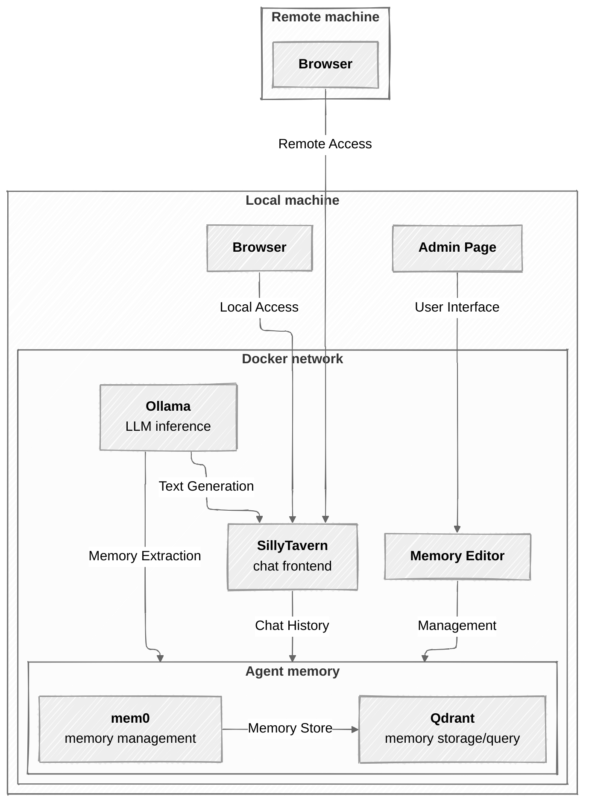

# Architecture




The source above is kept in sync with `architecture.mmd`, and both rely on
`architecture-font.css` (see its header comment for the two Chromium/mermaid
quirks it works around: multi-word font names failing to resolve inside SVG
`<foreignObject>`, and mermaid underestimating this font's label width).
Regenerate the SVG with:

```sh
./scripts/render-architecture-diagram.sh
```

That's just `mmdc -i docs/architecture.mmd -o docs/architecture.svg -C
docs/architecture-font.css` -- mmdc embeds `-C` content directly into the
saved SVG's own `<style>`, so the file is self-contained and the script
mainly exists so the exact command doesn't need re-deriving each time.

- **SillyTavern** — the chat UI. Only component exposed beyond `127.0.0.1`, reachable over Tailscale on `:8000`.
- **Ollama** — runs the local model (one model for both roleplay replies and memory extraction) plus the embedding model.
- **mem0-service** — decides what's worth remembering, sorts it into shared-vs-per-character, stores/retrieves it, and serves a small web UI for managing memories by hand.
- **Qdrant** — where the memory vectors actually live.

Everything except SillyTavern stays on `127.0.0.1` — only reachable from the host itself, never from the Tailscale network directly.
