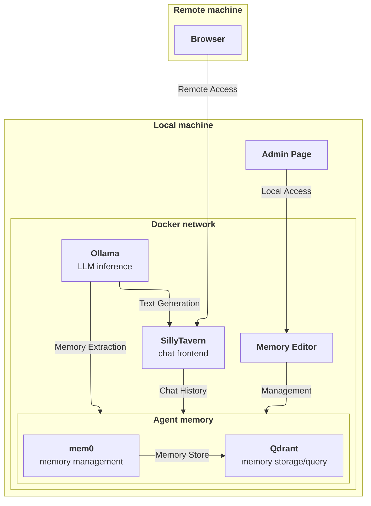

# Architecture

- **SillyTavern** — the chat UI. Only component exposed beyond `127.0.0.1`, reachable over Tailscale on `:8000`.
- **Ollama** — runs the local model (one model for both roleplay replies and memory extraction) plus the embedding model.
- **mem0-service** — decides what's worth remembering, sorts it into shared-vs-per-character, stores/retrieves it, and serves a small web UI for managing memories by hand.
- **Qdrant** — where the memory vectors actually live.

Everything except SillyTavern stays on `127.0.0.1` — only reachable from the host itself, never from the Tailscale network directly.
