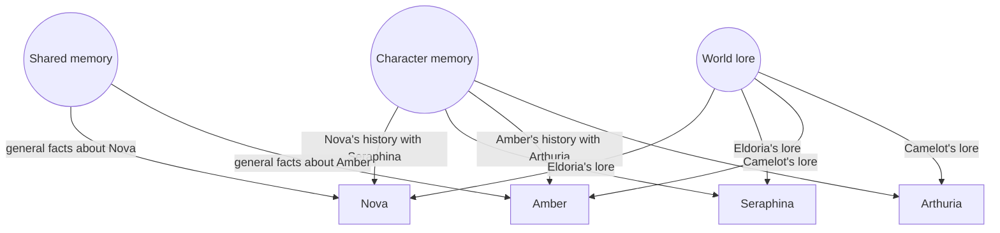
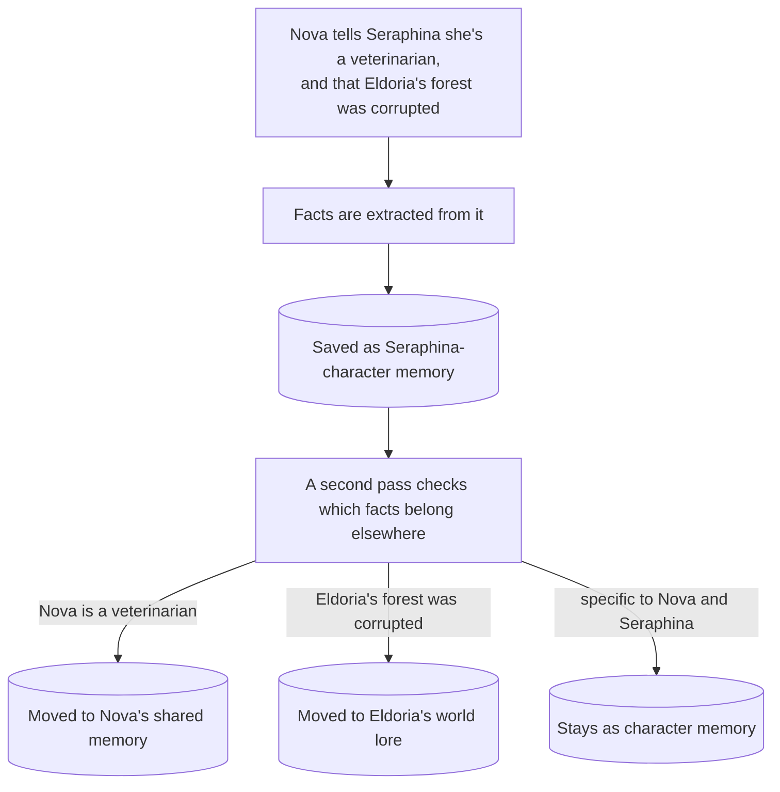
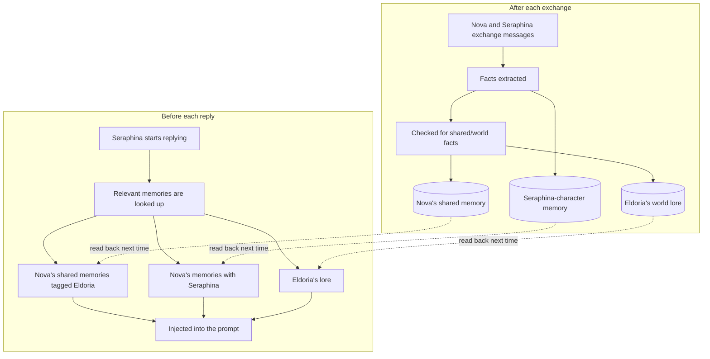

# Memory System

Everything the local model remembers about you, your characters, and your fictional worlds is stored and retrieved through [mem0](https://github.com/mem0ai/mem0) on top of [Qdrant](https://github.com/qdrant/qdrant), a vector database. Durable facts survive beyond what fits in the model's context window without resending or re-summarizing the whole past conversation. They are extracted once, stored, and pulled back later through a similarity search, then injected as a short line before the model replies. This page covers how that works and how to use it.

The examples below use two people, Nova and Amber, two characters, Seraphina and Arthuria, and two worlds, Eldoria and Camelot, to make the scoping concrete. Nova roleplays with Seraphina, who is bound to Eldoria. Amber roleplays with Arthuria, who is bound to Camelot.

## The three memory scopes

Every memory belongs to one of three scopes: who it is about, and which category it is filed under.

| Scope | Example fact | Belongs to | Visible to |
| --- | --- | --- | --- |
| **Character** | "Seraphina promised to protect Nova through the night" | Nova | only Nova, only in conversations with Seraphina |
| **Shared** | "Nova works as a veterinarian" | Nova | every character Nova talks to (optionally limited to one world, see below) |
| **World lore** | "Eldoria's forest was corrupted by the Shadowfangs" | no one in particular | anyone talking about Eldoria, Nova or Amber alike |

Character and shared memory are always tied to the real person: nothing Nova tells Seraphina is visible to Amber, and nothing in Nova's shared memory carries over to Amber either. World lore is the exception: nothing ties it to Nova or Amber specifically, so both of them see the same facts about whichever world they are talking about.

## World lore

A third layer holds facts about a fictional setting itself: Eldoria's geography and history, or Camelot's, are both examples. It replaces SillyTavern's built-in World Info system, which only matches lore into the prompt by literal keyword. This layer uses the same similarity search as the rest of the memory system, so a paraphrased question still finds the relevant lore.

### Binding a world

- A **character** picks up a world through its own card: the globe icon in SillyTavern's character panel, its "Primary Lorebook" picker. Seraphina's card is bound to Eldoria; Arthuria's is bound to Camelot.
- A **persona** can also bind to a world independently, through the persona panel's own lorebook picker.
- If both are set, the persona's binding takes priority. If neither is set, the exchange is not tied to any world.

Whichever World Info file gets bound this way should stay empty of its own entries. SillyTavern's native keyword-matching still runs on a bound World Info file regardless of this memory system, so leaving entries in it means the same lore can get injected twice: once from mem0, once from SillyTavern's own matching. Keeping the binding but clearing its entries avoids that.

### Building lore, two ways

- **Passively**, during ordinary roleplay: facts about the setting get picked out alongside the usual shared/character sorting (see "Sorting a memory" below), for whichever world is currently bound. This is how Eldoria's lore built up as Nova talked to Seraphina.
- **Actively**, with a dedicated interviewer character: import `sillytavern/character-cards/world-weaver.json` into SillyTavern, keeping the name exactly **World Weaver**, and talk to it like any other character. It asks about a world one question at a time and writes straight into that world's lore. This is how Camelot's lore could be built from scratch before Amber ever starts roleplaying with Arthuria. Because it writes into the same store the passive path reads from, a lorebook built this way is available immediately in a fresh roleplay session bound to that world. It never pulls in memory context for its own replies, so building a new world stays a clean slate, and every exchange with it is saved right away.

### A known limitation

Shared memory tagged with a world only resurfaces for that same world, so a personal detail like "Nova's mount is the Aetherian Stride" (learned while talking to Seraphina in Eldoria) does not leak into a conversation with Arthuria in Camelot. The tradeoff: a whole exchange shares one world tag, so a genuinely universal fact, say Nova's real name, learned while talking to Seraphina also stops surfacing later when Nova talks to Arthuria. This is a known, accepted limitation.

## Setting it up in SillyTavern

1. Enable the extension (Manage Extensions → **Roleplay Memory**) — see [Running the Stack](Running-the-Stack.md) step 7 if you have not yet.
2. Bind a character or persona to a world if you want world lore for it (globe icon on the character panel, or the persona panel's own lorebook picker).
3. To build lore deliberately, import `sillytavern/character-cards/world-weaver.json` as a character and talk to it, see "Building lore" above.
4. Browse, hand-edit, or delete any memory, including which world a shared memory is tagged with, at `http://localhost:8001/ui/`.

## How memories are extracted

A conversation does not become a memory verbatim. Say Nova tells Seraphina she works as a veterinarian, and mentions that Eldoria's forest was corrupted by the Shadowfangs. mem0 reads that exchange and produces self-contained, atomic factual statements from it: "Nova works as a veterinarian" and "Eldoria's forest was corrupted by the Shadowfangs," covering both what Nova said and what Seraphina said. This decides what is worth remembering at all.

The extraction step relies on a large prompt of its own, around 8,000 tokens, and any model doing extraction needs enough context space to hold it comfortably (16384 or higher, see [Changing the Model](Changing-the-Model.md)). A smaller context window silently truncates that prompt, and extraction quietly breaks.

## Sorting a memory into shared or world lore

Both facts from the example above start out saved as Seraphina-character memory, alongside anything actually specific to Nova and Seraphina's relationship. A second pass then checks each one: the veterinarian fact is general to Nova, so it moves to Nova's shared memory. The Shadowfangs fact is about the setting, so it moves to Eldoria's world lore. Anything left behind, say a private detail about how Seraphina reacted, stays as character memory. A fact only ever lives in one scope at a time.

This second pass is best-effort. If it fails for any reason, the character memory from the first pass stays as is.

## Automatic model sync

One model handles both roleplay generation and memory extraction, kept in sync automatically. The memory service asks the local inference server what models actually exist, and SillyTavern sends its own currently active model along with every extraction request. Switch models in SillyTavern's dropdown and extraction follows immediately, with nothing else to update.

## Storage

Qdrant stores every memory, across all three scopes, in one place, along with a smaller index that links named people, places, and terms mentioned in a memory back to that memory (see "The entity store" below). The embedding model that turns memories into searchable vectors, `nomic-embed-text-v1.5`, is served from the same local inference server as the chat models, so there is no separate embedding service to run.

## The entity store

mem0 keeps a lightweight index linking named entities, people, places, quoted terms, mentioned in a memory back to that memory. "Eldoria," "Seraphina," and "Shadowfangs" would each get their own entry, pointing back to every memory that mentions them. It boosts search relevance when a later query mentions one of those entities directly.

## How it all fits together

Putting the write and read paths together, for Nova talking to Seraphina in Eldoria:

