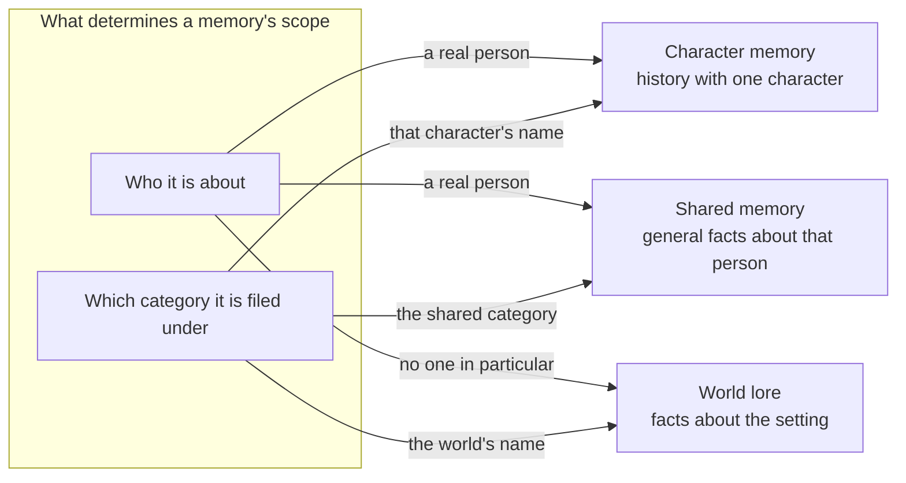
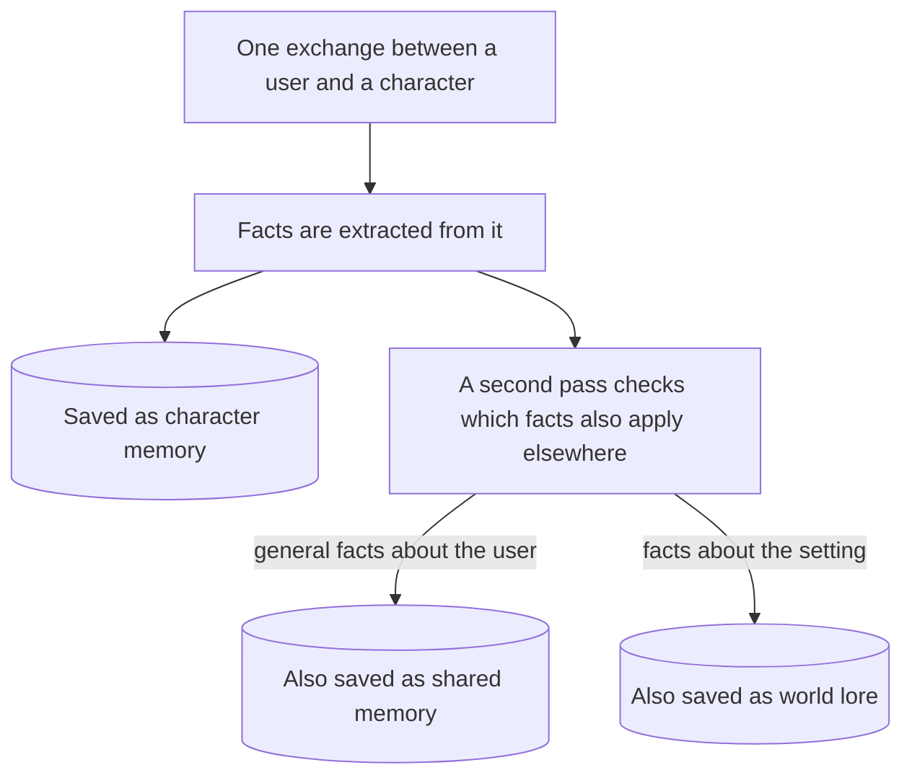
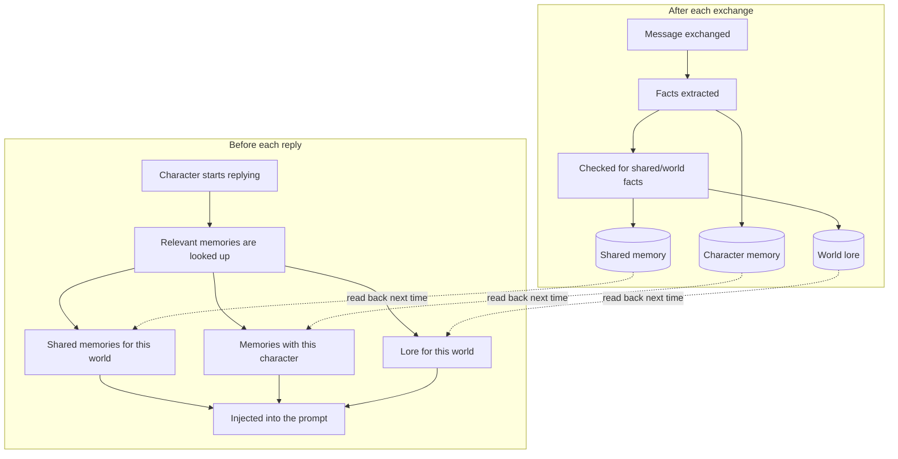

# Memory System

Everything the local model remembers about you, your characters, and your fictional worlds is stored and retrieved through [mem0](https://github.com/mem0ai/mem0) on top of [Qdrant](https://github.com/qdrant/qdrant), a vector database. Durable facts survive beyond what fits in the model's context window without resending or re-summarizing the whole past conversation. They are extracted once, stored, and pulled back later through a similarity search, then injected as a short line before the model replies. This page covers how that works and how to use it.

## The three memory scopes

Every memory belongs to one of three scopes: who it is about, and which category it is filed under.

| Scope | Example fact | Belongs to | Visible to |
| --- | --- | --- | --- |
| **Character** | "Seraphina's favorite color is silver" | a real person | just that one character, just that one person |
| **Shared** | "The user works as a veterinarian" | a real person | every character that person talks to (optionally limited to one world, see below) |
| **World lore** | "Eldoria's forest was corrupted by the Shadowfangs" | no one in particular | every person talking about that world |

Two different people, or two different SillyTavern personas, talking to the same character never see each other's character or shared memories. World lore is the one exception: it belongs to no one in particular, so it is genuinely shared by whoever talks about that world. It represents the world setting itself.

## How memories are extracted

A conversation does not become a memory verbatim. mem0 reads the exchange and produces self-contained, atomic factual statements from it, covering both what the user said and what the character said. This decides what is worth remembering at all.

The extraction step relies on a large prompt of its own, around 8,000 tokens, and any model doing extraction needs enough context space to hold it comfortably (16384 or higher, see [Changing the Model](Changing-the-Model.md)). A smaller context window silently truncates that prompt, and extraction quietly breaks.

## Sorting a memory into shared or world lore

After a memory is saved for a character, a second pass looks at those same facts and checks whether any of them also belong in shared memory or world lore. It works from the exact list of facts the first pass already produced, so nothing gets reworded along the way.

This second pass is best-effort. If it fails for any reason, the character memory from the first pass is saved regardless.

## Automatic model sync

One model handles both roleplay generation and memory extraction, kept in sync automatically. The memory service asks the local inference server what models actually exist, and SillyTavern sends its own currently active model along with every extraction request. Switch models in SillyTavern's dropdown and extraction follows immediately, with nothing else to update.

## Storage

Qdrant stores every memory, across all three scopes, in one place, along with a smaller index that links named people, places, and terms mentioned in a memory back to that memory (see "The entity store" below). The embedding model that turns memories into searchable vectors, `nomic-embed-text-v1.5`, is served from the same local inference server as the chat models, so there is no separate embedding service to run.

## The entity store

mem0 keeps a lightweight index linking named entities, people, places, quoted terms, mentioned in a memory back to that memory. It boosts search relevance when a later query mentions one of those entities directly.

## World lore

A third layer holds facts about a fictional setting itself: geography, history, factions. It replaces SillyTavern's built-in World Info system, which only matches lore into the prompt by literal keyword. This layer uses the same similarity search as the rest of the memory system, so a paraphrased question still finds the relevant lore.

### Binding a world

- A **character** picks up a world through its own card: the globe icon in SillyTavern's character panel, its "Primary Lorebook" picker.
- A **persona** can also bind to a world independently, through the persona panel's own lorebook picker.
- If both are set, the persona's binding takes priority. If neither is set, the exchange is not tied to any world.

### Building lore, two ways

- **Passively**, during ordinary roleplay: the sorting pass described above picks out setting-relevant facts alongside the usual shared/character sorting, for whichever world is currently bound.
- **Actively**, with a dedicated interviewer character: import `sillytavern/character-cards/world-weaver.json` into SillyTavern, keeping the name exactly **World Weaver**, and talk to it like any other character. It asks about a world one question at a time and writes straight into that world's lore. Because it writes into the same store the passive path reads from, a lorebook built this way is available immediately in a fresh roleplay session bound to that world. It never pulls in memory context for its own replies, so building a new world stays a clean slate, and every exchange with it is saved right away.

### A known limitation

Shared memory tagged with a world only resurfaces for that same world, so a personal detail like "the user's mount is the Aetherian Stride" does not leak into a conversation with a character from an unrelated setting. The tradeoff: a whole exchange shares one world tag, so a genuinely universal fact, say the user's real name, learned mid-roleplay also stops surfacing for unrelated worlds. This is a known, accepted limitation.

## Setting it up in SillyTavern

1. Enable the extension (Manage Extensions → **Roleplay Memory**) — see [Running the Stack](Running-the-Stack.md) step 7 if you have not yet.
2. Bind a character or persona to a world if you want world lore for it (globe icon on the character panel, or the persona panel's own lorebook picker).
3. To build lore deliberately, import `sillytavern/character-cards/world-weaver.json` as a character and talk to it, see "Building lore" above.
4. Browse, hand-edit, or delete any memory, including which world a shared memory is tagged with, at `http://localhost:8001/ui/`.

## How it all fits together

Putting the write and read paths together, for one full exchange with a character bound to a world:

