# Memory System

Everything the model remembers about you, your characters, and your fictional worlds is stored and retrieved through [mem0](https://github.com/mem0ai/mem0) on top of [Qdrant](https://github.com/qdrant/qdrant), a vector database, both self-hosted. This works the same way regardless of which backend SillyTavern is actually talking to for chat: a cloud API, an aggregator, or a local model. Durable facts survive beyond what fits in the model's context window without resending or re-summarizing the whole past conversation. They are extracted once, stored, and pulled back later through a similarity search, then injected as a short line before the model replies. This page covers how that happens, automatically, behind the scenes — see [Configuring the Memory System](Configuring-the-Memory-System.md) for turning it on and shaping its behavior, and [Managing Memories](Managing-Memories.md) for browsing, editing, or moving memories by hand.

The examples below use two people, Nova and Amber, two characters, Seraphina and Arthuria, and two worlds, Eldoria and Camelot, to make the scoping concrete. Nova roleplays with Seraphina, who is bound to Eldoria. Amber roleplays with Arthuria, who is bound to Camelot.

## The three memory scopes

Every memory belongs to one of three scopes: character, shared, or world lore — see [Managing Memories](Managing-Memories.md#the-three-memory-scopes) for what each one means and who can see it, with examples.

## World lore

The world lore layer holds facts about a fictional setting itself: Eldoria's geography and history, or Camelot's, are both examples. It replaces SillyTavern's built-in World Info system, which only matches lore into the prompt by literal keyword. This layer uses the same similarity search as the rest of the memory system, so a paraphrased question still finds the relevant lore. See [Configuring the Memory System](Configuring-the-Memory-System.md#binding-a-world) for binding a world to a character or persona, and [Managing Memories](Managing-Memories.md#building-lore-two-ways) for the two ways lore actually gets built.

### A known constraint

Shared memory tagged with a world only resurfaces for that same world, so a personal detail like "Nova's mount is the Aetherian Stride" (learned while talking to Seraphina in Eldoria) does not leak into a conversation with Arthuria in Camelot. The tradeoff: a genuinely universal fact, say Nova's real name, learned while talking to Seraphina also stops surfacing later when Nova talks to Arthuria.

## How memories are extracted

A conversation does not become a memory verbatim. Say Nova tells Seraphina she works as a veterinarian, and mentions that Eldoria's forest was corrupted by the Shadowfangs. mem0 reads that exchange and produces self-contained, atomic factual statements from it: "Nova works as a veterinarian" and "Eldoria's forest was corrupted by the Shadowfangs," covering both what Nova said and what Seraphina said. This decides what is worth remembering at all.

The extraction step relies on a large prompt of its own, around 8,000 tokens, and whichever model handles it needs enough context space to hold that comfortably. The bundled local setup keeps its context window at 16384 tokens or higher for exactly this reason (see [Changing the Model](Changing-the-Model.md)); a cloud model's context window is normally large enough on its own. A context window too small silently truncates the prompt, and extraction quietly breaks.

Extraction does not run on every single message either — see [Configuring the Memory System](Configuring-the-Memory-System.md#what-triggers-automatic-extraction) for what actually triggers it.

## Sorting a memory into shared or world lore

Both the shared and world facts from the example above start out saved as Seraphina-character memory, alongside anything actually specific to Nova and Seraphina's relationship. A second pass then checks each one: the veterinarian fact is general to Nova, so it moves to Nova's shared memory. The Shadowfangs fact is about the setting, so it moves to Eldoria's world lore. Anything left behind, say a private detail about how Seraphina reacted, stays as character memory. A fact only ever lives in one scope at a time. If it fails for any reason in the second pass, the character memory from the first pass stays as is.

  

## Automatic model sync

One connection handles both roleplay generation and memory extraction, kept in sync automatically, whichever backend SillyTavern is actually connected to: a cloud API like OpenAI or Claude, an aggregator like OpenRouter, or a local server like the bundled llama.cpp setup. Switch backends or models in SillyTavern's own connection settings and extraction immediately follows the change. The embedding model still needs to be separately configured (see [Storage](#storage) below for why).

## Storage

Qdrant stores every memory, across all three scopes, in one place, along with a smaller index that links named people, places, and terms mentioned in a memory back to that memory (see [The entity store](#the-entity-store) below). The embedding model that turns memories into searchable vectors, `nomic-embed-text-v1.5`, is served from the bundled local llama.cpp setup by default, so there is no separate embedding service to run unless you point it elsewhere. This is the one piece of the memory system that stays locally hosted regardless of which backend handles chat and extraction (see [Automatic model sync](#automatic-model-sync) above). It can be pointed at a different embedding endpoint if you want, but there always needs to be one configured.

`nomic-embed-text-v1.5` only supports English. For other languages, a multilingual embedding model would need to replace it. [EmbeddingGemma](https://huggingface.co/google/embeddinggemma-300m) (Google, about 100 languages, 768 dimensions; GGUF builds at [ggml-org/embeddinggemma-300M-GGUF](https://huggingface.co/ggml-org/embeddinggemma-300M-GGUF)) is the recommended option, backed by a real benchmark — see [Benchmarking](Benchmarking.md#embedding-model-nomic-embed-text-v15-vs-two-multilingual-alternatives). [nomic-embed-text-v2-moe](https://huggingface.co/nomic-ai/nomic-embed-text-v2-moe-GGUF), the other multilingual option that benchmark tested, is not recommended: it accepts far less text per embedding request than EmbeddingGemma, a hard limit from how it was trained, and this memory system's own retrieval step already produces requests long enough to exceed that limit in ordinary use. Switching is means that every existing memory's vector needs to be re-computed for the new model. A script for re-computing the vectors has not been developed but is planned.

## The entity store

mem0 keeps a lightweight index linking named entities, people, places, quoted terms, mentioned in a memory back to that memory. "Eldoria," "Seraphina," and "Shadowfangs" would each get their own entry, pointing back to every memory that mentions them. It boosts search relevance of the connected memories when a later query mentions one of those entities directly.

## How it all fits together

Before Seraphina's next reply, all three scopes are searched based on embedding closeness, keywords presence, and entity mentions. The retrieved memories are merged into the prompt:

  

